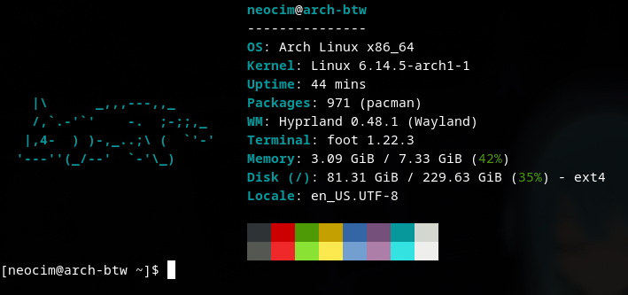

### About

This configuration shows only the necessary information, next 
to which the cat is lying. I use this in my `~/.bashrc` by inserting the following line into it:

```shell
fastfetch -c ~/.config/fastfetch/fastfetch.jsonc
```

This configuration looks like this:

